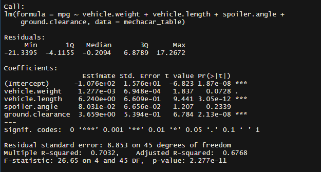
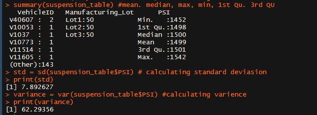
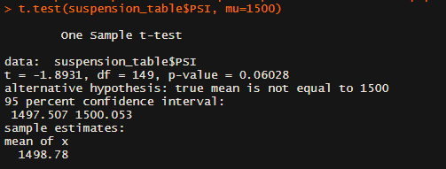

# MechaCar Challenge - Analysis
The MechaCar Analysis is conducted using RScrips. The data retrieved from MechaCar_mpg.csv and suspension_coil.csv.
## Objectives
	1. Design and interpret a multiple linear regression analysis to identify variables of interest.
	2. Calculate a summary statistics for quantitative variables.
	3. Perform a t-test in R and provide interpretation of results.
	4. Design statistical study to compare vehicle performance of two vehicles.

## Summary Analysis
### Design and interpret a multiple linear regression analysis to identify variables of interest.
	- Before creating multiple linear regression model created linear regression model for each variable to the mpg values.
		- the results show that there is a correlation between mpg values and vehicle length (p-value: 2.632e-06), and mpg values and ground clearance (p-value: 0.01975)
			- the p-value is less than 0.05
		- created linear regression plots.
		- the result show that the vehicle weight (p-value: 0.5311) and spoiler angle (p-value: 0.8858).
	- Conducted Multiple linear regression to predict the mpg of MechaCar prototypes using vehicle wight, vehicle length, spoiler angle and ground clearance variable within the MechaCar mpg dataset.
		- using lm() and summary() functions to create the coefficients for each variable. 
		- created 3D plots.
		- the results are: 

 

		- Which variables/coefficients provided a non-random amount of variance to the mpg values in the dataset? 
			- From the above summary output each Pr(>|t|) value represents the probability that each coefficient contributes a random of variance to the linear model. 
			- According to the results Intercept, vehicle.length and ground.clearance are the only variables that are statistically unlikely to provide random amounts of variance to the linear model.
		- Is the slope of the linear model considered to be zero? Why or why not?
			- According to the summary the p-value is small (2.277e-11) which is above 0.05, shows significant linear relationship between mpg and other valiables, thus we the slope is not equal to zero
		- Does this linear model predict mpg of MechaCar prototypes effectively? Why or why not?
			- No, this linear model does not predict mpg of MechaCar prototypes effectively as even if it works well with current dataset but will not generalize and predict future data correctly.

### Calculate a summary statistics for quantitative variables using suspension_coil.csv data.
	- Using summary(), sd() and var() calculated the summary statistics for the suspension coil's pounds-per-inch continuous variable.
	- The summary statistics is below with mean of 1499, median of 1500, standard deviation of 7.89 and variance of 62.29.
	- Does the current manufacturing data meet this design specification? Why or why not?
		- Yes, the current manufacturing data meet the design specification as the variance is less that 100 pounds per inch. 

### Perform a t-test in R and provide interpretation of results.
	- Using the suspension_coil.csv data performed t.test() analysis to determine if the suspension coil’s pound-per-inch results are statistically different from the mean population results of 1,500 pounds per inch.
	- Below is the t.test() summary. 
	- The p-value = 0.06028 which is greater that the significance level of 0.05, thus there is not duffivient evidence to reject the null hypothesis. 
	- the suspension coil’s pound-per-inch results are statistically similar from the mean population results of 1,500 pounds per inch.

### Design statistical study to compare vehicle performance of two vehicles.
	- Further analysis can be performed to compare the performance of the MechaCar prototype to other comparable vehicles on the market. 
	- We can compare the vehicle performance by comparing fuel efficiency and mpg of both type of vehicles by using Two-Sample t-Test.
	- Our hypothesis is:
		- If MechaCar prototype vehicle is more fuel efficient per mpg than other comparable vehicles.
	- Our null hypothesis is:
		- If MechaCar prototype vehicle is not more fuel efficient per mpg than other comparable vehicles. 
	- We can also do a stastistical study by using Chi-Squared Test by comparing vehicle body types.